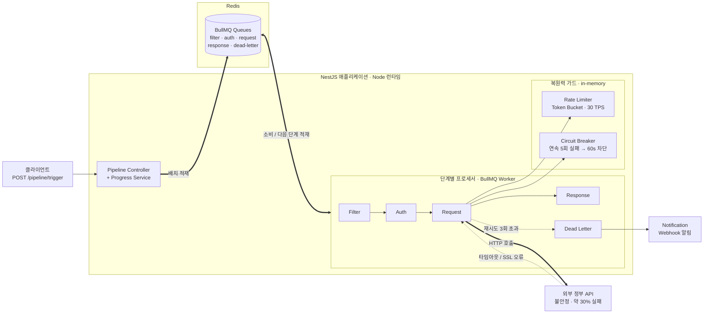

# Queue Pipeline Demo

> 불안정한 외부 정부 API를 안정적으로 처리하는 BullMQ 다단계 큐 파이프라인

## 배경

정부 API(공공 데이터 포털 등)는 타임아웃, SSL 오류, 비표준 응답이 빈번합니다.
이 프로젝트는 실제 프로덕션에서 **20,700건을 무장애 처리**한 큐 파이프라인 패턴을
범용 도메인으로 재구성한 것입니다.

## 아키텍처

```
┌─────────────┐     ┌──────────┐     ┌──────────┐     ┌──────────┐
│  Trigger    │────▶│  Filter  │────▶│   Auth   │────▶│ Request  │
│ (Batch/API) │     │ (검증)    │     │ (토큰)    │     │ (호출)    │
└─────────────┘     └──────────┘     └──────────┘     └────┬─────┘
                                                           │
                    ┌──────────┐     ┌──────────┐          │
                    │ Complete │◀────│ Response │◀─────────┘
                    │ (완료)    │     │ (파싱)    │
                    └──────────┘     └──────────┘
                                          │ (실패)
                                     ┌────▼─────┐
                                     │Dead Letter│──▶ Alert
                                     │(격리+재시도)│
                                     └──────────┘
```

## 인프라 구성

런타임에서 각 컴포넌트가 어떻게 연결되는지를 나타냅니다. 큐는 Redis에 적재되고,
프로세서가 이를 소비하며 단계 사이를 이동합니다. 복원력 가드(Rate Limiter·Circuit
Breaker)는 외부 API 호출 직전에 개입합니다.



| 컴포넌트 | 역할 | 비고 |
|----------|------|------|
| NestJS App | 컨트롤러 + 프로세서 + 가드 호스팅 | 수평 확장 시 Worker 인스턴스 추가 |
| Redis | 큐 백엔드 (durability) | 서버 재시작해도 작업 유지 |
| Rate Limiter / Circuit Breaker | 외부 API 보호 | 현재 in-memory, 다중 인스턴스 시 Redis 공유 필요 |
| 외부 정부 API | 처리 대상 | 타임아웃·SSL·30% 실패 시뮬레이션 |
| Notification | Dead Letter 알림 | Webhook |

## 핵심 설계 결정

### 1. 왜 큐인가 (for-loop 재시도 대신)

```typescript
// ❌ Before: 서비스 내 동기 재시도 (실제 레거시 패턴)
for (let i = 0; i < 5; i++) {
  const res = await callApi();
  if (!res) { await sleep(1000); continue; }
  return res;
}

// ✅ After: 큐 기반 비동기 재시도
// - 서비스가 블로킹되지 않음
// - 실패 건만 격리되어 재시도
// - 진행률 추적 가능
// - 서버 재시작해도 큐에 남아있음 (durability)
```

### 2. Rate Limiting (30 TPS 제한)

정부 API는 초당 요청 수를 제한합니다. Token Bucket으로 호출 간격을 제어합니다.

### 3. Circuit Breaker

연속 N회 실패 시 큐 일시 정지 → health check 통과 후 재개.
전체 시스템이 불안정한 외부 API에 의해 멈추는 것을 방지합니다.

### 4. Dead Letter Queue

최대 재시도 초과 건을 별도 큐에 격리. 수동 검토 후 재처리하거나,
알림을 통해 즉시 대응합니다.

## 기술 스택

- **NestJS** — DI 기반 모듈 구조, 프로세서 분리
- **BullMQ** — Redis 기반 고성능 큐, 지수 백오프, 작업 우선순위
- **Redis** — 큐 백엔드 + Rate Limiter + Circuit Breaker 상태
- **TypeScript** — Strict 모드, 타입 안전성

## 실행

```bash
# Redis 필요
docker run -d -p 6379:6379 redis

# 설치 + 실행
pnpm install
pnpm build
pnpm start

# 배치 트리거 (예: 1000건 처리)
curl -X POST http://localhost:3000/pipeline/trigger \
  -H "Content-Type: application/json" \
  -d '{"count": 1000}'
```

## 프로젝트 구조

```
src/
├── app.module.ts
├── main.ts
├── queue/
│   ├── pipeline.module.ts
│   ├── pipeline.controller.ts          # 트리거 API
│   ├── pipeline.service.ts             # 배치 생성
│   ├── pipeline-progress.service.ts    # 진행률 추적
│   ├── dto/
│   │   └── trigger-pipeline.dto.ts     # 입력 검증 DTO
│   ├── processors/
│   │   ├── filter.processor.ts         # 입력 검증 + 필터링
│   │   ├── auth.processor.ts           # 토큰 획득 (캐시 + 갱신)
│   │   ├── request.processor.ts        # 외부 API 호출
│   │   ├── response.processor.ts       # 응답 파싱 + 정규화
│   │   └── dead-letter.processor.ts
│   └── guards/
│       ├── rate-limiter.ts             # Token Bucket (30 TPS)
│       └── circuit-breaker.ts          # 연속 실패 시 차단
├── types/
│   └── job.types.ts                    # 큐 이름 + Job 데이터 타입
└── notification/
    └── notification.service.ts         # 실패 알림 (Webhook)
```

## 프로덕션 적용 결과

- **20,700건** 외부 API 호출 무장애 처리
- Rate Limit 준수하며 안정적 처리 (30 TPS)
- Dead Letter 발생률 0.3% 미만
- 서버 재시작 시에도 큐에서 자동 재개 (durability 보장)

## 개선 포인트 (기존 대비)

| 기존 구현 | 이 데모 |
|----------|---------|
| 1,700줄 단일 서비스 | 단계별 프로세서 분리 |
| for-loop 재시도 | BullMQ 지수 백오프 |
| sleep() 기반 rate limit | Token Bucket 알고리즘 |
| health check만 존재 | Circuit Breaker 패턴 |
| Google Chat 단일 알림 | 구조화된 Notification 서비스 |
